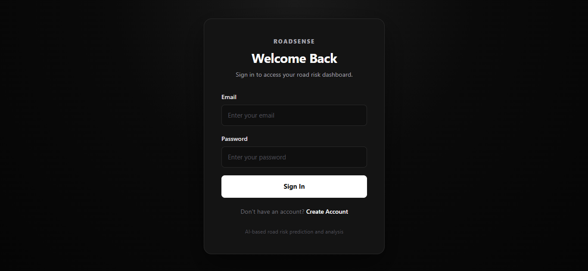
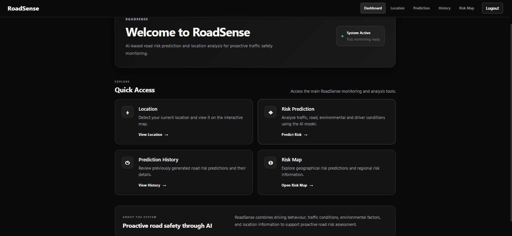
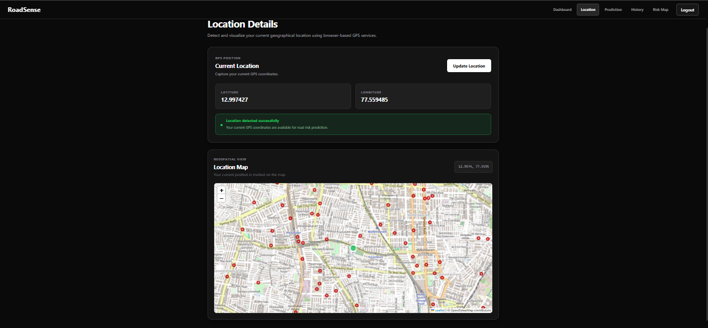
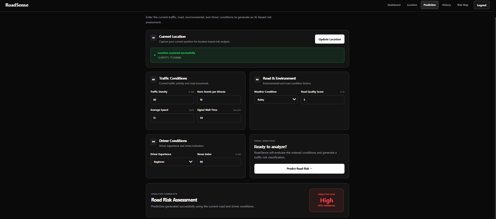
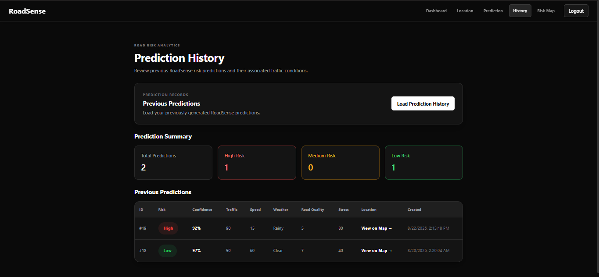
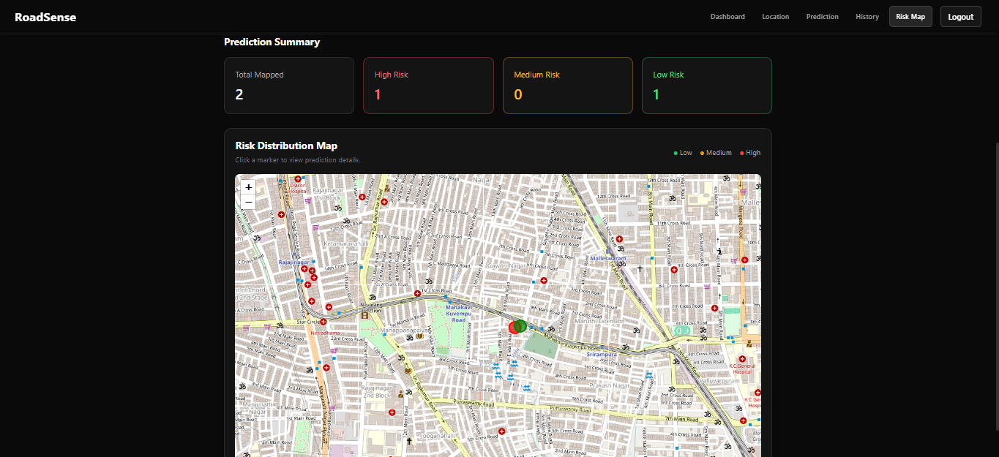

# RoadSense: AI-Based Traffic Risk Detection and Geospatial Analysis

## Overview

**RoadSense** is an AI-based traffic risk detection system that uses Machine Learning to predict road and traffic risk levels based on traffic, environmental, road, and driver-related conditions.

The system analyzes multiple parameters such as traffic density, horn events, average speed, signal waiting time, weather condition, road quality, driver experience, and driver stress to classify the current traffic risk as **Low, Medium, or High**.

RoadSense combines Machine Learning, a FastAPI backend, user authentication, location detection, prediction history, and interactive geospatial visualization to support proactive traffic risk monitoring.

---

## Key Features

* Machine Learning-based traffic risk prediction
* Random Forest Classifier for risk classification
* Analysis of traffic, environmental, road, and driver-related parameters
* Data preprocessing and categorical encoding
* Model persistence using Joblib
* Prediction confidence calculation
* FastAPI backend for serving the ML model
* JWT-based user authentication
* Protected prediction API
* User-specific prediction history
* Browser-based GPS location detection
* Interactive maps using Leaflet and OpenStreetMap
* Location-based risk visualization
* Regional risk analysis
* Risk distribution map with Low, Medium, and High risk markers
* Interactive prediction details through map popups
* React frontend integrated with the FastAPI backend

---

## System Workflow

```text
User Login
    ↓
Dashboard
    ↓
Capture Location
    ↓
Enter Traffic / Road / Driver Conditions
    ↓
FastAPI Prediction API
    ↓
Machine Learning Model
    ↓
Risk Classification
    ↓
Confidence Calculation
    ↓
Store Prediction
    ↓
Prediction History
    ↓
Geospatial Risk Visualization
    ↓
Regional Risk Analysis
```

---

## Technologies Used

### Machine Learning

* Python
* Pandas
* Scikit-learn
* Joblib

### Backend

* FastAPI
* Python
* SQLAlchemy
* JWT Authentication
* SQLite

### Frontend

* React.js
* Vite
* JavaScript
* React Router
* Leaflet
* React Leaflet
* OpenStreetMap

---

## Dataset Features

The Machine Learning model uses the following features for traffic risk prediction:

| Feature                   | Description                      |
| ------------------------- | -------------------------------- |
| `traffic_density`         | Traffic density level            |
| `horn_events_per_min`     | Number of horn events per minute |
| `avg_speed`               | Average vehicle speed            |
| `signal_wait_time`        | Waiting time at traffic signals  |
| `weather_condition`       | Current weather condition        |
| `road_quality_score`      | Road quality rating              |
| `driver_experience_level` | Driver experience category       |
| `stress_index`            | Driver stress level              |

The model predicts one of three risk categories:

* **Low Risk**
* **Medium Risk**
* **High Risk**

---

## Machine Learning Pipeline

```text
Dataset Collection
        ↓
Data Preprocessing
        ↓
Feature Engineering
        ↓
Risk Label Generation
        ↓
Categorical Encoding
        ↓
Train-Test Split
        ↓
Random Forest Training
        ↓
Model Evaluation
        ↓
Model Persistence
        ↓
Risk Prediction
```

---

## Model Used

### Random Forest Classifier

A **Random Forest Classifier** is used for the traffic risk classification task.

Random Forest is suitable for the project because the system works with structured tabular data containing multiple traffic, environmental, road, and driver-related features.

The trained model and required encoders are persisted using **Joblib** and loaded by the FastAPI backend during prediction.

---

## Current System

The current RoadSense implementation supports:

### Authentication

* User registration
* User login
* JWT-based authentication
* Protected API endpoints

### Risk Prediction

* Traffic condition input
* Road and environmental condition input
* Driver condition input
* Current GPS location capture
* Machine Learning-based risk prediction
* Risk confidence score

### Prediction History

* Storage of generated predictions
* User-specific prediction history
* Display of previous prediction parameters
* Risk classification and confidence
* Associated location information

### Location Analysis

* Browser-based GPS detection
* Latitude and longitude capture
* Interactive location map
* OpenStreetMap integration

### Risk Map

* Geographic visualization of previous predictions
* Risk-based map markers
* Low, Medium, and High risk visualization
* Interactive prediction popups
* Regional risk analysis
* Regional prediction summary
* Geographic region center calculation

---

## Model Performance

The current trained Random Forest model achieved approximately **99% accuracy** on the available evaluation dataset.

Model evaluation includes:

* Accuracy
* Classification Report
* Confusion Matrix

The saved model and encoders are used to generate predictions for new traffic and road conditions.

> Note: Model performance depends on the available dataset and evaluation methodology.

---

## Application Screenshots

### Login



### Register


### Dashboard



### Location Detection



### Traffic Risk Prediction



### Prediction History



### Risk Map



---

## Project Structure

```text
traffic-risk-system/
│
├── backend/
│   ├── app/
│   │   ├── api/
│   │   ├── auth/
│   │   ├── core/
│   │   ├── db/
│   │   ├── ml/
│   │   └── services/
│   │
│   ├── requirements.txt
│   └── ...
│
├── frontend/
│   ├── src/
│   │   ├── components/
│   │   ├── pages/
│   │   └── ...
│   │
│   ├── public/
│   ├── package.json
│   └── ...
│
├── screenshots/
│   ├── login.png
│   ├── dashboard.png
│   ├── location.png
│   ├── prediction.png
│   ├── prediction-result.png
│   ├── history.png
│   └── risk-map.png
│
└── README.md
```

---

## How to Run

### Backend

Navigate to the backend directory:

```bash
cd backend
```

Install the Python dependencies:

```bash
pip install -r requirements.txt
```

Start the FastAPI server:

```bash
uvicorn app.main:app --reload
```

The API will be available at:

```text
http://127.0.0.1:8000
```

FastAPI Swagger documentation:

```text
http://127.0.0.1:8000/docs
```

### Frontend

Open another terminal and navigate to the frontend directory:

```bash
cd frontend
```

Install the dependencies:

```bash
npm install
```

Start the development server:

```bash
npm run dev
```

The frontend will normally be available at:

```text
http://localhost:5173
```

---

## Future Enhancements

The following features can be considered for future development:

* Real-time traffic data integration
* Real-time traffic monitoring
* Accident hotspot visualization
* Risk-based route analysis
* Alternate route recommendation
* Video-based traffic behavior analysis
* CNN-based traffic analysis
* BiLSTM-based temporal traffic analysis
* Integration with smart-city transportation systems

---

## Author

**Monish V**
